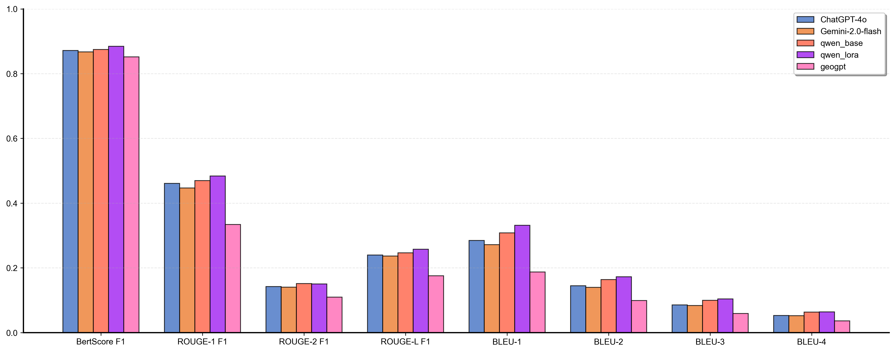
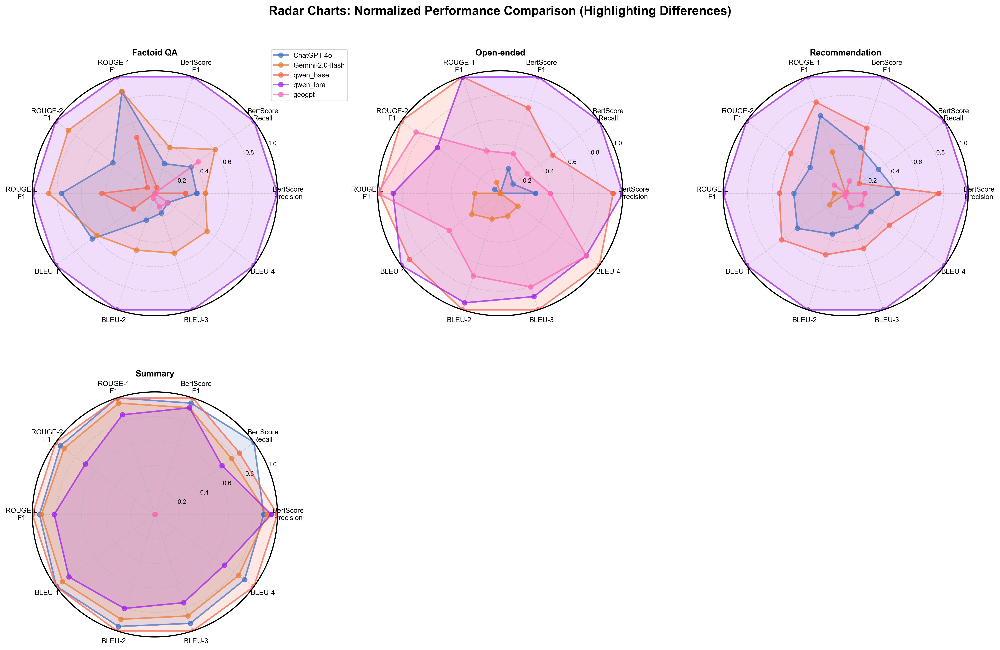

# Qwen3-SFT-RAG
Vertical domain Supervised Fine-Tuning, and Retrieval Augmented Generation for geological disasters

## 数据收集
包括：论文摘要+开源论文全文+C4数据集+行业标准数据
1. 地壳活动灾害 Crustal Activity Hazards (earthquake OR "seismic event" OR "seismic hazard"……)
2. 斜坡岩土体运动灾害 Slope and Rock-Soil Mass Movement Hazards (landslide OR "slope failure" OR "rockfall"……) 
3. 地面变形灾害 Ground Deformation Hazards (ground subsidence OR "surface subsidence" ……)
4. 矿山与地下工程灾害 Mining and Underground Engineering Hazards ("coal spontaneous combustion"……)
5. 城市地质灾害 Urban Geological Hazards ("building foundation deformation" OR ……)
6. 河、湖、水库灾害 River, Lake and Reservoir Hazards ("riverbank collapse" OR "riverbank erosion"……)
7. 海岸带灾害 Coastal Zone Hazards ("sea level rise" OR "sea level change" OR "sea level fall"……)
8. 海洋地质灾害 Marine Geological Hazards ("submarine landslide" OR "underwater landslide"……)
9. 特殊岩土灾害 Special Rock and Soil Hazards ("loess collapse" OR "loess subsidence" OR "loess landslide"……) 
10. 土地退化灾害 Land Degradation Hazards ("soil erosion" OR "water erosion" OR "wind erosion"……)
11. 水土污染与地球化学异常灾害 Water-Soil Pollution and Geochemical Hazard ("ground water pollution"……)
12. 水源枯竭灾害 Water Source Depletion Hazards ("river water loss" OR "river water depletion"……)

## 开源论文链接获取
```bash
# 批量获取PDF链接，后续使用下载工具根据链接下载论文PDF
python ./src/get_pdf_links.py
```

## 数据预处理
```bash
# 预处理PDF文件，提取文本内容并保存为TXT格式，再转换为Parquet格式，
python ./src/pdf2txt2parquet.py
# 进一步清洗和处理文本数据，最终生成用于训练和检索的Parquet文件
python ./src/parquet_process.py
# 将所有文献数据和关键词过滤的C4数据合并，构建最终的训练和检索数据集jsonl格式
python ./src/merge_all_training_data.py
```

## 微调数据集构建
```bash
## Extractor_Agent

# 人工编写49x20=980条相关语料（来源：论文查阅）存放在./data/annotation_data_expert/目录下
# LLM语料扩增49x185=9,065，共计10k高质量语料数据（分地质灾害大类、小类）存放在./data/annotation_data_llm/目录下
# 基于上述两部分数据，从merged_data.jsonl进一步检索地质灾害主题相关的语料，构建Extractor_Agent的微调数据集
python ./src/semantic_search.py
# 基于语义检索得到的样本片段发送给gpt-40-mini，进行微调数据生成
# python ./src/XXX

## Generator Agent 

# 人工编写49x4=196条微调数据格式样例存放在./data/samples_for_Generator Agent/目录下
# 基于上述样例数据，使用gpt-40-mini进行微调数据生成，构建Generator Agent的微调数据集
python ./src/generate_finetuning_data_for_generator_agent.py
```

## Qwen3 微调

```bash
# 使用LlamaFactory框架进行Qwen3的微调，环境配置llamafactory(0.9.4.dev0)
# 微调脚本qwen_3_8b_lora_sft.yaml
cd ./LLaMA-Factory/
llamafactory-cli train examples/train_lora/qwen_3_8b_lora_sft.yaml
```
### 微调结果
Data1：地质灾害相关问答（事实问答、开放性问答、推理问答、总结问答）


Data2：注册岩土工程师考试题库测试（单选题）
| 模型	|正确率 |
|-------|-------|
| Gemini-2.0-flash | 66.27% |
| DeepSeekR1-GeoGPT | 65.86% |
| gpt-4o-2024-05-13 | 60.64% |
| Qwen3_base | 61.45% |
| Qwen3_lora | 66.27% |

## Qwen3 RAG系统构建

```bash
# 构建基于Qwen3的RAG系统，使用ChromaDB作为向量数据库，FAISS作为检索工具
# 构建向量数据库，使用Qwen3-Embedding-4B模型进行文本嵌入
python ./src/build_database.py
# 构建RAG系统，使用Qwen3-8B-Lora-SFT模型作为生成器，ChromaDB进行检索, Qwen3-Reranker-4B
python ./src/qwen3_rag.py
```
